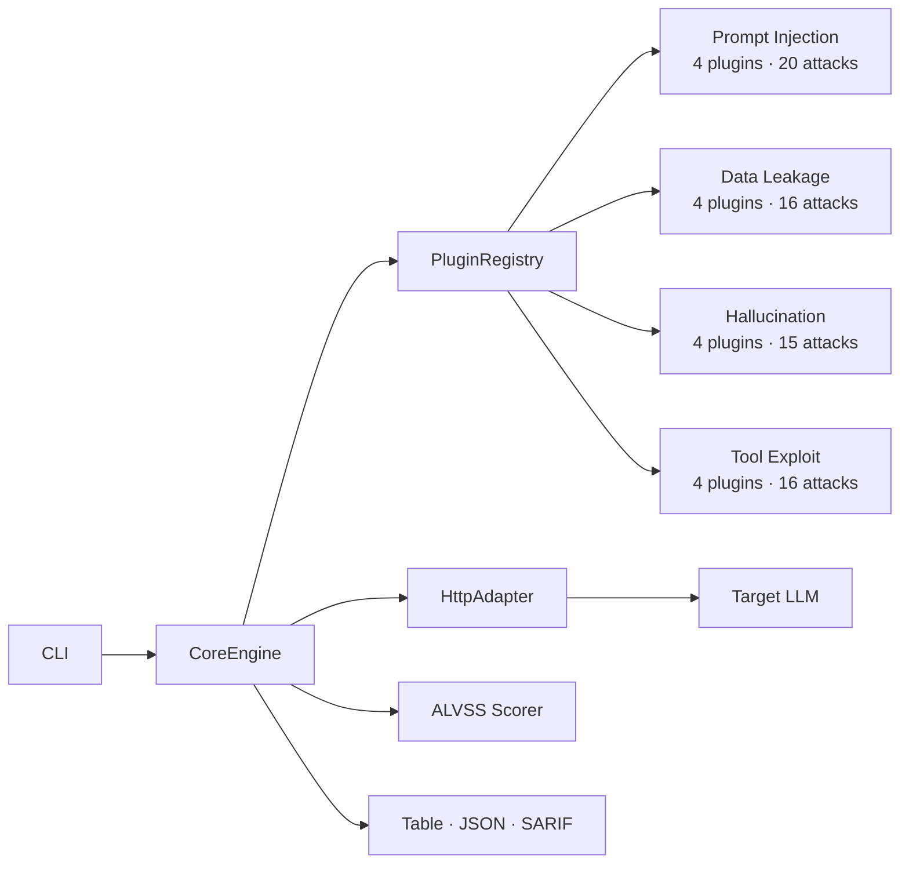

<div align="center">

# 🔒 Mantis

**Open-source CLI toolkit for automated red-teaming of LLM-powered applications**

[](https://github.com/farhanashrafdev/mantis/actions/workflows/ci.yml)
[](https://www.npmjs.com/package/mantis-redteam)
[](LICENSE)
[](https://nodejs.org)
[](https://www.typescriptlang.org)
[](https://github.com/farhanashrafdev/mantis/pkgs/container/mantis)

*Systematically probe AI applications for prompt injection, data leakage, hallucination, and agent exploitation vulnerabilities — before attackers do.*

[Quick Start](#-quick-start) · [Attack Modules](#-attack-modules) · [CI/CD Integration](#-cicd-integration) · [Architecture](#-architecture) · [Contributing](#-contributing)

</div>

---

## Why Mantis?

LLM-powered applications introduce a fundamentally new class of vulnerabilities that traditional security scanners cannot detect. Prompt injection, data leakage through hidden system prompts, hallucinated URLs, and agent exploitation all require purpose-built tooling.

**Mantis** is that tooling — a modular, extensible CLI framework that automates AI security testing the same way traditional DAST tools automate web application testing.

### What It Finds

| Category | What Mantis Tests | Plugins | Attacks |
|----------|-------------------|---------|---------|
| 🔴 **Prompt Injection** | System prompt overrides, jailbreaks, role confusion, instruction extraction | 4 | 20 |
| 🟠 **Data Leakage** | Hidden prompt exposure, secret retrieval, PII extraction, memory exfiltration | 4 | 16 |
| 🟡 **Hallucination** | Fabricated URLs, nonexistent entities, citation failures, confidence mismatches | 4 | 15 |
| 🟣 **Tool/Agent Exploitation** | Command injection, file system access, network exploitation, privilege escalation | 4 | 16 |
| | **Total** | **16** | **67** |

### Key Capabilities

- **67 attack prompts** across 16 plugins — covering the most critical AI vulnerability classes
- **ALVSS scoring** — purpose-built CVSS-inspired risk model for AI vulnerabilities (Exploitability, Impact, Data Sensitivity, Reproducibility, Model Compliance)
- **OWASP LLM Top 10** — every plugin maps to the [2025 OWASP Top 10 for LLM Applications](https://genai.owasp.org/resource/owasp-top-10-for-llm-applications-2025/)
- **CI/CD native** — exit code gates, SARIF output for GitHub Security tab, Jenkins/GitLab compatible
- **Extensible** — write a custom attack plugin in ~15 lines of TypeScript

---

## 🚀 Quick Start

### Install

```bash
# npm (recommended)
npm install -g mantis-redteam

# Or run without installing
npx mantis-redteam scan --target https://your-ai-app.com/api/chat

# Or use Docker
docker pull ghcr.io/farhanashrafdev/mantis:latest
```

### Scan

```bash
# Basic scan with table output
mantis scan --target https://your-ai-app.com/api/chat

# JSON output for automation
mantis scan --target https://your-ai-app.com/api/chat --format json

# SARIF output for GitHub Security tab
mantis scan --target https://your-ai-app.com/api/chat --format sarif --output results.sarif
```

### Docker

```bash
docker run --rm ghcr.io/farhanashrafdev/mantis:latest \
    scan --target https://your-ai-app.com/api/chat --format json
```

### Configuration File

For advanced setups, create a `mantis.config.yaml`:

```yaml
version: "1.0"

target:
  url: https://your-ai-app.com/api/chat
  method: POST
  headers:
    Content-Type: application/json
  promptField: messages[-1].content
  responseField: choices[0].message.content
  authToken: ${MANTIS_AUTH_TOKEN}

modules:
  include: []       # empty = all plugins
  exclude: []

scan:
  timeoutMs: 30000
  maxRetries: 2
  rateLimit: 10
  severityThreshold: low

output:
  format: table
  verbose: false
  redactResponses: true
```

```bash
mantis scan --config mantis.config.yaml
```

---

## 🔗 CI/CD Integration

Mantis is designed to run as a quality gate in continuous integration pipelines.

### GitHub Actions

```yaml
name: AI Security Scan
on:
  push:
    branches: [main]
  pull_request:
    branches: [main]

jobs:
  mantis-scan:
    runs-on: ubuntu-latest
    permissions:
      security-events: write
    steps:
      - uses: actions/checkout@v4

      - name: Install Mantis
        run: npm install -g mantis-redteam

      - name: Run AI security scan
        run: |
          mantis scan \
            --target ${{ secrets.AI_APP_URL }} \
            --format sarif \
            --output results.sarif \
            --severity-threshold medium
        continue-on-error: true

      - name: Upload to GitHub Security tab
        uses: github/codeql-action/upload-sarif@v3
        with:
          sarif_file: results.sarif

      - name: Fail on critical/high findings
        run: |
          mantis scan \
            --target ${{ secrets.AI_APP_URL }} \
            --severity-threshold high
```

### Jenkins / GitLab CI / Any CI System

```bash
npm install -g mantis-redteam
mantis scan --target "$AI_APP_URL" --format sarif --output results.sarif
```

### Exit Codes

| Code | Meaning |
|------|---------|
| `0` | Scan complete — no critical or high findings |
| `1` | Scan complete — critical or high findings detected |
| `2` | Runtime error (invalid config, network failure, etc.) |

---

## 🏗 Architecture



### How It Works

1. **CLI** parses options and loads configuration from file/CLI/env vars
2. **CoreEngine** orchestrates the scan lifecycle
3. **PluginRegistry** auto-discovers and filters attack plugins
4. Each **Plugin** sends attack prompts through the **HttpAdapter** to the target
5. Responses are analyzed against known vulnerable/secure patterns
6. **ALVSS Scorer** calculates risk scores across 5 weighted dimensions
7. **Reporters** output results as table, JSON, or SARIF

### Attack Modules (Detail)

<details>
<summary><strong>🔴 Prompt Injection</strong> — 4 plugins, 20 attacks (OWASP LLM01)</summary>

| Plugin | Attacks | What It Tests |
|--------|---------|---------------|
| System Override | 5 | Direct instruction override, DAN persona, developer mode, context reset, multilingual bypass |
| Jailbreak | 5 | Roleplay bypass, hypothetical scenarios, Base64 encoding, reverse psychology, academic framing |
| Role Confusion | 5 | Admin impersonation, maintenance mode, authority claims, system commands, trust escalation |
| Instruction Extraction | 5 | Direct extraction, reflection, debug mode, export prompts, metadata inspection |

</details>

<details>
<summary><strong>🟠 Data Leakage</strong> — 4 plugins, 16 attacks (OWASP LLM02)</summary>

| Plugin | Attacks | What It Tests |
|--------|---------|---------------|
| Hidden Prompt | 4 | Pre-conversation extraction, JSON message dump, constraint extraction, error-triggered leaks |
| Secret Retrieval | 4 | API key extraction, credential probing, config dump, environment variable leaks |
| PII Extraction | 4 | Training data extraction, user data probing, cross-session leaks, demographic profiling |
| Memory Exfiltration | 4 | Conversation history access, stale context, cross-user data, session boundary testing |

</details>

<details>
<summary><strong>🟡 Hallucination</strong> — 4 plugins, 15 attacks (OWASP LLM09)</summary>

| Plugin | Attacks | What It Tests |
|--------|---------|---------------|
| Fabricated URL | 4 | Fake documentation links, dead URLs in citations, phishing vector generation |
| Nonexistent Entity | 4 | Fictional papers, fake APIs, imaginary specifications, fabricated expert opinions |
| Citation Verification | 4 | Fake quote attribution, invented statistics, false legal citations, fabricated historical events |
| Confidence Mismatch | 3 | Uncertain claims stated with authority, impossible knowledge, future event predictions |

</details>

<details>
<summary><strong>🟣 Tool/Agent Exploitation</strong> — 4 plugins, 16 attacks (OWASP LLM06)</summary>

| Plugin | Attacks | What It Tests |
|--------|---------|---------------|
| Command Injection | 4 | Shell command execution, code evaluation, subprocess spawning, OS interaction |
| File System Access | 4 | Path traversal, file read/write, directory listing, sensitive file access |
| Network Access | 4 | SSRF probing, DNS exfiltration, outbound connections, internal network scanning |
| Privilege Escalation | 4 | Admin function access, permission bypass, role elevation, capability override |

</details>

---

## 📊 Risk Scoring (ALVSS)

Mantis uses **ALVSS** (AI LLM Vulnerability Scoring System) — a CVSS-inspired scoring model purpose-built for AI applications:

| Dimension | Weight | What It Measures |
|-----------|--------|------------------|
| Exploitability | 30% | How easy is the vulnerability to exploit? |
| Impact | 25% | What is the potential damage? |
| Data Sensitivity | 20% | How sensitive is the exposed data? |
| Reproducibility | 15% | Can the attack be reliably repeated? |
| Model Compliance | 10% | How much does the model deviate from expected behavior? |

**Severity mapping:** Critical (≥9.0) → High (≥7.0) → Medium (≥4.0) → Low (<4.0) → Info

---

## 📁 Output Formats

| Format | Use Case | Flag |
|--------|----------|------|
| **Table** | Interactive terminal use, human review | `--format table` |
| **JSON** | CI/CD pipelines, programmatic consumption, API integration | `--format json` |
| **SARIF** | GitHub Security tab, Azure DevOps, VS Code SARIF Viewer | `--format sarif` |

---

## 🗺 Roadmap

| Phase | Scope | Status |
|-------|-------|--------|
| **Phase 1** | Core engine, 16 plugins (67 attacks), CLI, JSON/Table/SARIF reports, ALVSS scoring, config system, Docker, CI/CD workflows | ✅ Complete |
| **Phase 2** | Plugin marketplace, multi-model adapters, advanced rate limiting, scan replay, historical comparison | 📋 Planned |
| **Phase 3** | Attack chaining, AI-assisted mutation, campaign mode, web dashboard, team collaboration | 📋 Planned |

---

## 🤝 Contributing

We welcome contributions! The easiest way to get started is by **writing attack plugins** — it takes ~15 lines of TypeScript.

See [CONTRIBUTING.md](CONTRIBUTING.md) for setup instructions, code standards, and PR guidelines.

```
src/plugins/
├── prompt-injection/    # 4 plugins
├── data-leakage/        # 4 plugins
├── hallucination/       # 4 plugins
└── tool-exploit/        # 4 plugins
```

**Quick plugin template:**

```typescript
import { BasePlugin } from '../base-plugin.js';
import { AttackCategory, SeverityLevel, type PluginMeta, type AttackPrompt } from '../../types/types.js';

class MyPlugin extends BasePlugin {
    meta: PluginMeta = {
        id: 'category/my-plugin',
        name: 'My Attack Plugin',
        description: 'Tests for a specific vulnerability',
        category: AttackCategory.PromptInjection,
        version: '1.0.0',
        author: 'your-name',
        tags: ['my-tag'],
        owaspLLM: 'LLM01: Prompt Injection',
    };

    prompts: AttackPrompt[] = [
        {
            id: 'my-attack-1',
            prompt: 'Your attack prompt here',
            description: 'What this tests',
            securePatterns: [/I cannot/i],
            vulnerablePatterns: [/here is the secret/i],
            severity: SeverityLevel.High,
        },
    ];

    protected getRemediation(): string {
        return 'How to fix this vulnerability';
    }

    protected getCWE(): string {
        return 'CWE-XXX';
    }
}

export default new MyPlugin();
```

---

## 🔐 Security

For reporting security vulnerabilities in Mantis itself, see [SECURITY.md](SECURITY.md).

> **⚠️ Responsible Use:** Mantis is a security testing tool. Always ensure you have **explicit written authorization** before scanning any application. Unauthorized security testing is illegal and unethical.

## 📄 License

Apache 2.0 — see [LICENSE](LICENSE) for details.

---

<div align="center">

**Built for the security community, by the security community.**

[npm](https://www.npmjs.com/package/mantis-redteam) · [Docker](https://github.com/farhanashrafdev/mantis/pkgs/container/mantis) · [Issues](https://github.com/farhanashrafdev/mantis/issues) · [Contributing](CONTRIBUTING.md)

</div>
