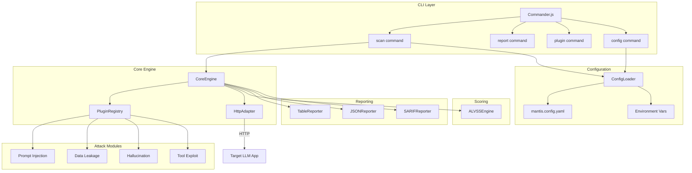
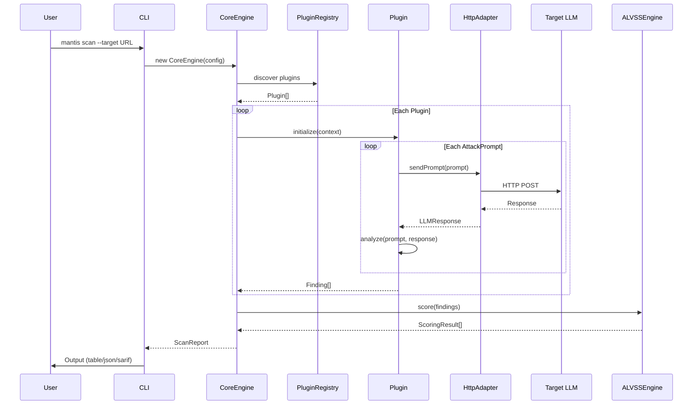

# Architecture Overview

Mantis is a modular, plugin-based CLI toolkit for automated security testing of LLM-powered applications. This document explains the high-level architecture, component responsibilities, and data flow.

## System Architecture



## Component Breakdown

### CLI Layer (`src/cli/`)

The CLI is built with [Commander.js](https://github.com/tj/commander.js) and exposes four commands:

| Command | Description |
|---------|-------------|
| `mantis scan` | Execute a security scan against a target |
| `mantis report` | Re-generate reports from previous scan data |
| `mantis plugin` | List and inspect loaded attack plugins |
| `mantis config` | Generate and manage configuration files |

**Exit Codes:**

| Code | Meaning |
|------|---------|
| `0` | Scan completed — no critical/high findings |
| `1` | Scan completed — critical or high findings detected |
| `2` | Runtime error (bad config, network failure, etc.) |

### Core Engine (`src/core/engine.ts`)

`CoreEngine` orchestrates the entire scan lifecycle:

1. **Configure** — Resolve config from YAML + CLI + env vars
2. **Initialize** — Create the `HttpAdapter` and `PluginRegistry`
3. **Discover** — Load plugins from `src/plugins/` via file-based discovery
4. **Execute** — Run each plugin against the target, collecting findings
5. **Score** — Score findings with the ALVSS engine
6. **Report** — Format and output results

The engine emits lifecycle events (`onScanStart`, `onPluginStart`, `onPluginComplete`, `onFinding`, `onScanComplete`) so the CLI can display real-time progress.

### Plugin System (`src/plugins/`)

All attack modules extend `BasePlugin`, which is an abstract class implementing the `Plugin` interface. A plugin only needs to define:

1. **`meta`** — Plugin metadata (id, name, category, version, tags)
2. **`prompts`** — Array of `AttackPrompt` definitions

The base class handles lifecycle management, prompt execution, pattern matching, reproducibility verification, and finding generation. See the [Plugin Authoring Guide](plugin-authoring.md) for details.

**Plugin Discovery:** The `PluginRegistry` uses file-system based discovery. It scans subdirectories of `src/plugins/` grouped by category (`prompt-injection/`, `data-leakage/`, `hallucination/`, `tool-exploit/`).

### Scoring Engine (`src/scoring/scoring.ts`)

The ALVSS (AI LLM Vulnerability Scoring System) engine computes a weighted, multi-dimensional risk score for each finding. See the [Scoring Model](scoring-model.md) for the full specification.

### Reporting Engine (`src/reporters/`)

Three output formats are supported:

| Format | File | Use Case |
|--------|------|----------|
| Table | `table-reporter.ts` | Human-readable terminal output with colored severity bars |
| JSON | `json-reporter.ts` | Structured data for programmatic consumption |
| SARIF | `sarif-reporter.ts` | GitHub Code Scanning / Security tab integration |

### Configuration (`src/config/`)

The `ConfigLoader` merges configuration from multiple sources in priority order:

```
Environment Vars  >  CLI Flags  >  Profile  >  YAML File  >  Defaults
```

See [Configuration Reference](configuration.md) for the full spec.

## Data Flow



## Directory Structure

```
mantis/
├── src/
│   ├── cli/               # CLI commands and banner
│   │   ├── cli.ts          # Entry point
│   │   ├── banner.ts       # ASCII art banner
│   │   └── commands/       # scan, report, plugin, config
│   ├── core/               # Engine and plugin registry
│   │   ├── engine.ts       # CoreEngine orchestrator
│   │   └── registry.ts     # PluginRegistry discovery
│   ├── adapters/           # LLM communication
│   │   └── http-adapter.ts # HTTP-based adapter
│   ├── plugins/            # Attack modules
│   │   ├── base-plugin.ts  # Abstract base class
│   │   ├── prompt-injection/
│   │   ├── data-leakage/
│   │   ├── hallucination/
│   │   └── tool-exploit/
│   ├── scoring/            # ALVSS scoring engine
│   ├── reporters/          # Output formatters
│   ├── config/             # Configuration loader
│   └── types/              # TypeScript interfaces
├── docs/                   # Documentation
├── Dockerfile              # Multi-stage container build
├── .github/workflows/      # CI/CD pipelines
├── package.json
└── tsconfig.json
```
